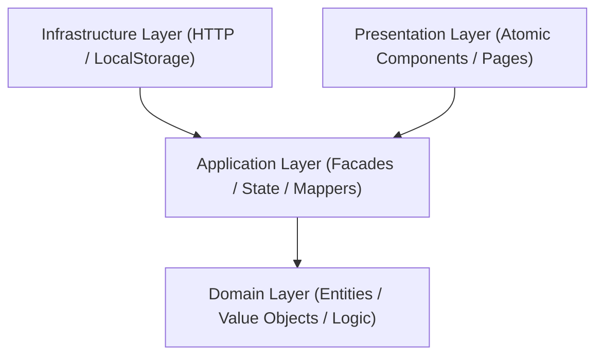

# 🚀 OpsBoard-Pro

**OpsBoard-Pro** is a mission-critical Enterprise Operations Dashboard designed for real-time monitoring, incident management, and secure deployment orchestration. Built with modern Angular and strict Clean Architecture principles, it provides a "Pro" level experience for site reliability and infrastructure teams.

---

## 🎯 Project Objectives

- **Unified Operations Visibility**: Real-time correlation of incidents, deployments, and logs in a single high-performance interface.
- **Secure Deployment Orchestration**: Multi-stage approval workflows for sensitive environments (Staging/Production).
- **High-Fidelity Incident Management**: Rapid response tracking with automated SLA breach detection and audit trails.
- **Enterprise-Grade Observability**: Advanced log filtering with full-text search and historical persistence.

---

## 📂 Project Structure

```text
OpsBoard-Pro/
├── Dockerfile              # Production Docker build
├── nginx.conf              # Nginx configuration for SPA
├── docker-compose.yml      # Production deployment
├── docker-compose.dev.yml  # Development environment
├── server/
│   └── db.json             # Mock backend data
├── src/
│   ├── app/
│   │   ├── core/           # Interceptors, Guards, Utilities
│   │   ├── domain/         # Business entities & logic
│   │   ├── application/    # Facades, Mappers, State
│   │   ├── infrastructure/ # API Repositories & Services
│   │   ├── layouts/        # Shell & Navigation layouts
│   │   └── shared/         # Atomic UI components
│   └── environments/       # Environment-specific configs
└── styles/                 # Global SCSS & Design Tokens
```

---

## 🏗️ Architecture: Clean & Scalable

The project strictly adheres to **Clean Architecture** patterns to ensure extreme testability and separation of concerns:



### Layer Responsibilities
- **Domain Layer**: Pure business logic. Contains `Incident`, `Deployment`, and `User` entities with immutable state transitions.
- **Application Layer**: Orchestrates use cases using **NgRx Store/Effects** and **Facades**. Handles DTO ↔ Domain mapping.
- **Infrastructure Layer**: Implementation details for external services (API Clients, HTTP Repositories).
- **Presentation Layer**: UI implementation using **Signals** for reactive local state and a strictly **Atomic Design** component system.

---

## 🧩 Implementation Patterns

### 1. Reactive Orchestration (NgRx + Signals)
We use a hybrid approach to state management:
- **Global State (NgRx)**: Mission-critical data like authentication and global audit logs.
- **Local Reactive State (Signals)**: UI-bound states like hover effects, form validations, and real-time dashboard filtering.
- **Facades**: Abstract away the complexities of the Store, providing a clean API for components.

### 2. Workflow State Machines
Deployments and Incidents follow strict state machines defined in the domain layer. Transitions (e.g., `REQUESTED` -> `APPROVED` -> `RUNNING`) are validated before state updates to prevent illegal operations.

---

## 🐳 Docker Setup

### 1. Development (with Hot-Reload)
This setup mounts your local code into the container, allowing for real-time development without restarting.
```bash
docker compose -f docker-compose.dev.yml up
```
The app will be available at `http://localhost:4200`.

### 2. Production Simulation
This setup mimics a real production environment using a multi-stage Docker build and Nginx for serving.
```bash
docker compose up --build
```
The app will be available at `http://localhost:80`.

---

## 🛡️ Architecture & Security Decisions (Docker)

### 1. Multi-Stage Builds
We use a 2-stage Docker build to keep the production image lightweight:
- **Build Stage**: Uses Node.js 20 to compile the Angular application and install only necessary dependencies.
- **Runtime Stage**: Uses a minimal Nginx Alpine image to serve the final static assets, completely removing build tools and source code from the final image.

### 2. SPA-Aware Nginx Configuration
The `nginx.conf` is optimized for Angular and security:
- **SPA Routing**: Configured to redirect all missing paths to `index.html`, allowing the Angular Router to handle deep-linked URLs.
- **Performance**: Pre-configured Gzip compression for all text-based assets (JS, CSS, JSON).
- **Security Headers**: Implements `X-Frame-Options`, `X-XSS-Protection`, and a strict `Content-Security-Policy`.

---

## 🚦 Getting Started (Local)

### 1. Prerequisites
Ensure you have the latest Node.js and Angular CLI installed.

### 2. Start the Mock Server
```bash
npx json-server server/db.json
```

### 3. Run the App
```bash
npm install
ng serve
```

Access the dashboard at `http://localhost:4200`. Use `admin@opsboard.pro` / `123456` (MFA: `123456`) to access the admin features.

---
> [!NOTE]
> This project maintains **zero lint errors** and strict TypeScript validation as part of its CI/CD quality gates.
