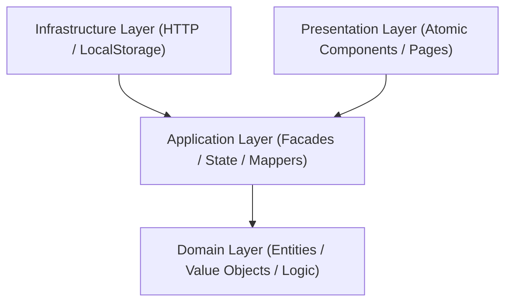

# 🚀 OpsBoard-Pro

**OpsBoard-Pro** is a mission-critical Enterprise Operations Dashboard designed for real-time monitoring, incident management, and secure deployment orchestration. Built with modern Angular and strict Clean Architecture principles, it provides a "Pro" level experience for site reliability and infrastructure teams.

---

## 🎯 Project Objectives

- **Unified Operations Visibility**: Real-time correlation of incidents, deployments, and logs in a single high-performance interface.
- **Secure Deployment Orchestration**: Multi-stage approval workflows for sensitive environments (Staging/Production).
- **High-Fidelity Incident Management**: Rapid response tracking with automated SLA breach detection and audit trails.
- **Enterprise-Grade Observability**: Advanced log filtering with full-text search and historical persistence.

---

## 🏗️ Architecture: Clean & Scalable

The project strictly adheres to **Clean Architecture** patterns to ensure extreme testability and separation of concerns:



### Layer Responsibilities
- **Domain Layer**: Pure business logic. Contains `Incident`, `Deployment`, and `User` entities with immutable state transitions.
- **Application Layer**: Orchestrates use cases using **NgRx Store/Effects** and **Facades**. Handles DTO ↔ Domain mapping.
- **Infrastructure Layer**: Implementation details for external services (API Clients, HTTP Repositories).
- **Presentation Layer**: UI implementation using **Signals** for reactive local state and a strictly **Atomic Design** component system.

---

## 🧩 Implementation Patterns

### 1. Reactive Orchestration (NgRx + Signals)
We use a hybrid approach to state management:
- **Global State (NgRx)**: Mission-critical data like authentication and global audit logs.
- **Local Reactive State (Signals)**: UI-bound states like hover effects, form validations, and real-time dashboard filtering.
- **Facades**: Abstract away the complexities of the Store, providing a clean API for components.

### 2. Atomic Design System
The UI is organized into granular, reusable units:
- **Atoms**: `Badge`, `Button`, `Icon`, `Input`. Stateless and visually consistent.
- **Molecules**: `FilterForm`, `LogEntryRow`, `SavedSearches`. Groups of atoms performing a single function.
- **Organisms**: `IncidentList`, `DeploymentCard`, `RecentIncidentsList`. Complex UI sections with internal orchestration.
- **Pages**: `Dashboard`, `UserManagement`, `IncidentDetail`. Composite views that tie features together.

### 3. Workflow State Machines
Deployments and Incidents follow strict state machines defined in the domain layer. Transitions (e.g., `REQUESTED` -> `APPROVED` -> `RUNNING`) are validated before state updates to prevent illegal operations.

### 4. Repository & Mapper Pattern
Data integrity is enforced by decoupling raw API responses from domain logic through **Mappers**. Every I/O operation goes through a **Repository** contract, allowing for easy swapping between Mock and Real APIs.

---

## 🛠️ Tech Stack

- **Framework**: Angular 19+ (Signals, Built-in Control Flow)
- **State**: NgRx (Store, Effects, Entity) + Angular Signals
- **Styling**: Vanilla SCSS (Modular Design Tokens)
- **Visuals**: Lucide Icons & Custom SVG Atoms
- **Data Visualization**: High-performance SVG Charts

---

## 🚦 Getting Started

### 1. Prerequisites
Ensure you have the latest Node.js and Angular CLI installed.

### 2. Start the Mock Server
The project uses `json-server` to simulate a backend.
```bash
npx json-server server/db.json
```

### 3. Run the App
```bash
npm install
ng serve
```

Access the dashboard at `http://localhost:4200`. Use `admin@opsboard.pro` / `123456` (MFA: `123456`) to access the admin features.

---
> [!NOTE]
> This project maintains **zero lint errors** and strict TypeScript validation as part of its CI/CD quality gates.
