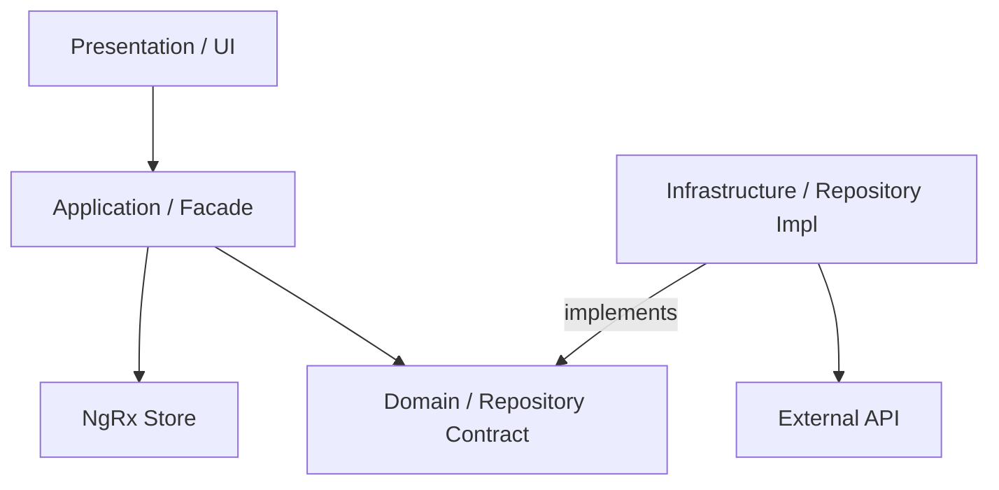

# Architecture Guide - OpsBoard Pro

## Overview
OpsBoard Pro follows **Clean Architecture** principles and **Atomic Design** for the UI layer. The project is structured to ensure separation of concerns, testability, and scalability.

## Layers

### 1. Domain Layer (`src/app/features/*/domain`)
- **Entities**: Plain TypeScript objects representing the core business models.
- **Value Objects**: Objects defined by their attributes (e.g., `AuthToken`).
- **Contracts (Repositories)**: Interfaces that define how data should be accessed, without implementation details.

### 2. Application Layer (`src/app/features/*/application`)
- **Services (Facades)**: Orchestrate business logic and state.
- **State Management**: NgRx Store, Actions, Reducers, and Selectors.
- **Effects**: Handle side effects like API calls and navigation.

### 3. Infrastructure Layer (`src/app/features/*/infrastructure`)
- **Adapters (Repositories)**: Concrete implementations of domain contracts (e.g., `HttpRepository`).
- **Mappers**: Transform API DTOs to Domain Entities and vice-versa.

### 4. Presentation Layer (`src/app/features/*/presentation`)
- **Components**: Divided into Atoms, Molecules, Organisms, and Pages (Atomic Design).
- **Styles**: Scoped SCSS with global design tokens.

## Communication Pattern

## Best Practices
- **Zoneless-ready**: Use Signals and `OnPush` change detection where possible.
- **Type Safety**: Avoid `any`. Use `unknown` or specific interfaces.
- **Dependency Injection**: Use the `inject()` function over constructor injection.
